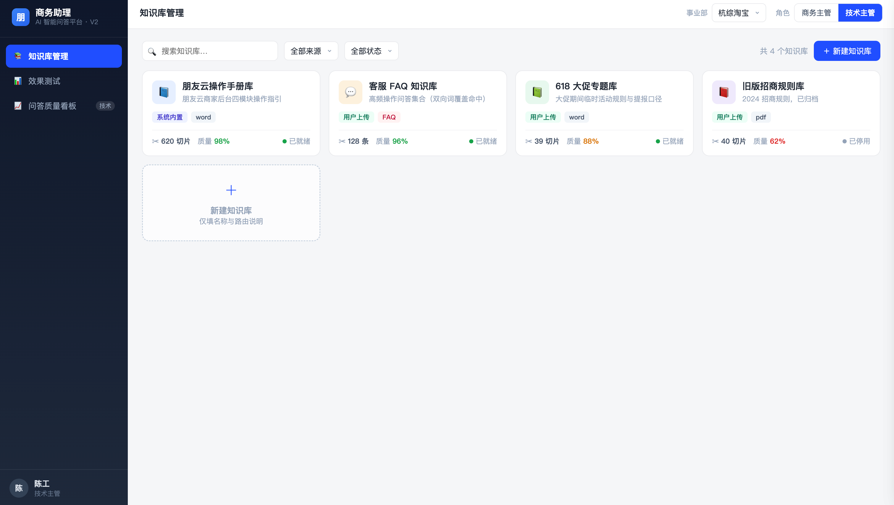
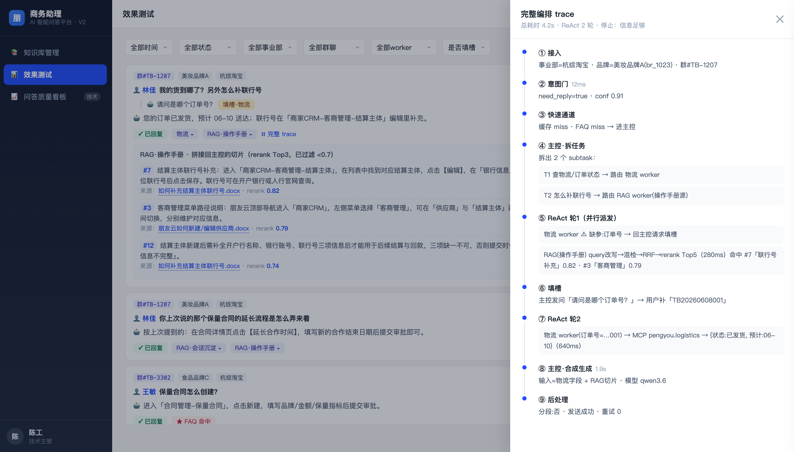
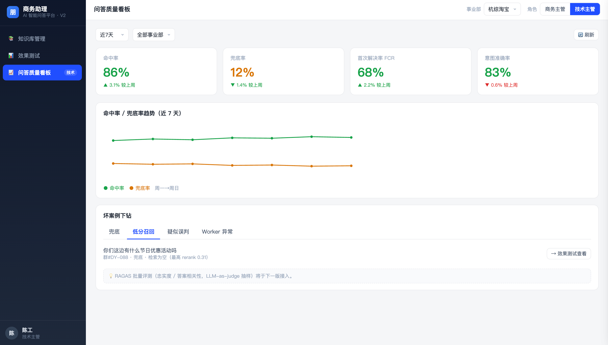
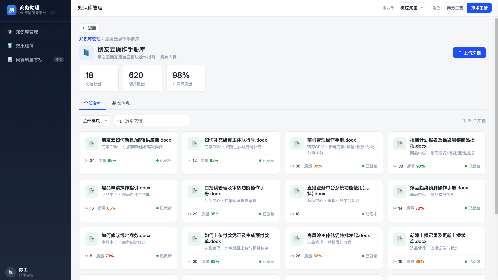
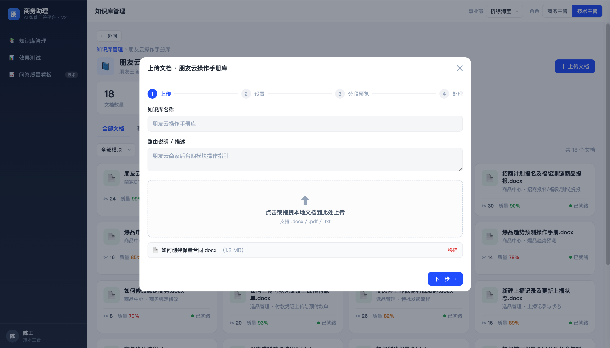

# shangwu-assistant · 商务助理 AI 智能问答平台（前端原型）

> 一个面向企业微信外部群的智能问答机器人的**前端原型**，采用 orchestrator-workers 架构（主控编排 + 五个 worker）。它不是跑起来的系统，而是把主控编排、填槽、意图静默、全程 trace、质量看板——做成**能点的界面**，让一份架构设计从文字变成可以演示、可以争论的东西。**单文件、零后端、断网也能跑。**


**中文版** | [English](./README.md)

---

## 它是什么

一个面向**企业微信外部群**的智能问答机器人的产品原型。机器人代替运营，指导品牌方使用「朋友云」商家系统——品牌方在群里问一句"我的货到哪了""保量合同怎么创建""我这个月被扣分了吗"，机器人带着取数结果和操作手册依据把话答回去。

它的核心是一套 **orchestrator-workers** 编排（参考 Anthropic 的多智能体研究模式）：检索只是其中一个 worker，外面由主控负责拆任务、路由、并行调度、重规划与最终合成。这个仓库就是它的**前端**：八个页面 + 若干弹层，所有数据是写死的 mock，把架构里每一个抽象概念都落成了看得见、点得动的界面。

在线问答主链路长这样：

```
群消息进来
   ↓
接入层    事业部定性 + 品牌识别（贯穿全链路的取数上下文 = 事业部 · 品牌 · 群id）
   ↓
预处理    清洗 · 近 5 轮历史 · pending 检查
   ↓
意图门    need_reply？ ──否──→ 静默（不发群，只在后台留一条 UI 日志）
   ↓ 是
快速通道  缓存命中 / FAQ 命中 ──命中──→ 直接回，不进主控
   ↓ 未命中
主控编排  拆 subtask → 按 worker 描述路由 → 并行派发 → ReAct 重规划（≤5 轮）
   ├─ RAG worker            操作手册库 / 本群会话沉淀（叠不叠会话源由主控决定）
   ├─ 物流 / 合同 / 报价 / 违规扣分   经朋友云 MCP 取数（事业部 + 品牌鉴权）
   └─ worker 缺参？ → 回主控，由主控统一向群里填槽（pending 3h）
   ↓
主控合成  收齐各 worker 精炼结果 → LLM 生成最终话术
   ↓
后处理 & 发送  ＋ 全程 trace 落库
```

## 特性

- **🧩 把 Agent 编排画出来**：主控拆任务、五个 worker 并行、ReAct 重规划、最后主控合成——每一步在界面上都看得见，不是黑盒里跑完给你一句话。
- **👀 一个机器人账号，两种视角**：技术主管看**完整 trace** + 质量看板；商务主管只看 worker **拼接内容**。同一条会话，角色不同，能看到的不同——切个角色立刻变。
- **🔍 RAG 不只给答案，给证据**：worker 标签**行内展开**看召回切片（Top5、带 rerank 分、已过滤 <0.7）；点切片索引**直接跳进知识库对应文档**并高亮那一段。
- **🔇 该闭嘴时闭嘴**：意图门判定"无需回复"的消息不发群，只在后台留一条 `【该消息无需触发智能问答】`；效果测试里静默会话单独成一种状态，不和已回复混在一起。
- **🧱 三维隔离贯穿界面**：事业部（操作手册 + 业务数据）/ 群聊 id（会话沉淀）/ 品牌（取数鉴权）三个维度，在知识库、会话流水、测试对话里处处可筛、可归属。
- **🗂 知识库该管的都能点**：系统内置库只读；用户上传库可**改名改描述、整库停用、单文档停用**，还带「最近一次操作」时间戳；FAQ 可**停用 / 启用 / 删除**（删除走页面内二次确认）。
- **🧪 坏案例可下钻**：看板上的兜底 / 低分召回 / 疑似误判 / **worker 调用异常**，点一下精确跳到效果测试里**那一条真实会话**并高亮，不是跳个大概。
- **📦 单文件、零依赖、零后端**：一个 `.html`，双击就开，所有数据写死，断网照跑。

## 截图

<!-- 把图片放到 docs/screenshots/ 下，文件名和下面对应即可；没有的行先删掉 -->











*截图里的事业部、品牌、群、问答全是模拟数据。*

## 八个页面

| 模块 | 页面 | 看点 |
| --- | --- | --- |
| 知识库管理 | 知识库列表 | 按事业部维度，卡片带质量分、来源、状态 |
| | 知识库详情 | 文档列表 + 基本信息；操作手册库用**四模块真实文档名** |
| | 文档详情 | 切片 + 质量条 + 右侧"单库测试"；用户库文档可停用 |
| | FAQ 库 | Q-A 列表，每条可停用 / 启用 / 删除，带导入入口 |
| | 新建库 / 上传向导 | 新建只填名称 + 路由说明（不传文件）；上传走 4 步向导 |
| 效果测试 | 会话流水 | 时间倒序一条大流，群id 标签可筛，三状态 + 填槽内嵌 + worker 行内展开 |
| | 全链路测试对话 | 测整条 Agent 链路；技术主管看 trace，商务主管看拼接内容 |
| 问答质量看板 | （仅技术主管） | 命中率 / 兜底率 / FCR / 意图准确率 + 坏案例下钻 |

## 两种角色

顶栏一键切换，界面差异化：

| 角色 | 进得了的页面 | 完整 trace | worker 拼接内容 | 质量看板 |
| --- | --- | --- | --- | --- |
| **商务主管** | 知识库管理 · 效果测试 | ❌ | ✅ | ❌（导航里都不出现） |
| **技术主管** | 全部 | ✅（右侧抽屉，逐阶段耗时） | ✅ | ✅ |

> 完整 trace 做成右侧抽屉：拆任务 → ReAct 轮次 → MCP 调用 → 填槽 → 合成，逐阶段带耗时；worker 调用超时 / 返回错误码的异常链路也能点开看它怎么走到兜底。

## 快速上手

没有依赖、没有构建。三选一：

```bash
# 1. 直接双击 商务助理AI智能问答平台_前端原型.html

# 2. 或本地起个静态服务
npx serve .
# 然后打开 http://localhost:3000

# 3. 或 Python
python3 -m http.server 8080
# 然后打开 http://localhost:8080
```

打开后建议路线：右上角切到**技术主管** → 进**效果测试** → 展开第一条会话的「RAG·操作手册」看完整切片、点切片 `#7` 跳进文档 → 点「← 返回」回到效果测试 → 再去**问答质量看板**点「Worker 异常」案例验证下钻跳转。

## 仓库结构

```
├── 商务助理AI智能问答平台_前端原型.html   # 全部内容：HTML + CSS + 原生 JS + mock 数据，单文件
├── docs/screenshots/                       # README 里引用的界面截图
├── README.md                               # 英文
└── README.zh-CN.md                         # 中文
```

## 几个刻意的设计

- **生成放在主控，不放 worker** —— worker 只回契约化的精炼结果（RAG 回 rerank 后的切片、业务 worker 回干净字段），主控统一合成。worker 是"取数的手"，主控是"说话的嘴"。
- **填槽只有一个出口** —— worker 缺参不自己问，回主控；由主控统一向群里发问，避免多个 worker 抢着追问。`context_scope`（事业部 / 品牌）自动注入不问，只有真缺的业务参数（如订单号）才填槽。
- **未找到就老实兜底** —— 检索为空 / 全部低于阈值，群里回固定话术「抱歉，未找到相关信息请联系对应商务」，让商务能接手；不编。
- **系统库和用户库不一样** —— 系统内置的操作手册库只读、不可停用；用户自己传的库才给改名 / 停用 / 删除的权力。
- **危险操作页面内确认** —— 删除 FAQ 弹自定义确认框（"删除后将无法复原"），不是浏览器原生弹窗。

## 状态

作品集级前端原型：交互按产品形态搭全（角色差异、三维隔离、编排可视化、trace 抽屉、坏案例下钻），数据全是模拟的，用来对齐 PRD 与架构、做评审和演示。后端另起。

## 许可证

MIT — 见 [LICENSE](./LICENSE)。

## 作者

**Danyang**

---

*这个原型想回答的问题是：当一个问答机器人从"检索一段话"变成"一群 worker 协作 + 一个主控编排"——这套复杂度，到底该怎么摆到人眼前，让用它的人看得懂、信得过、查得到。*
